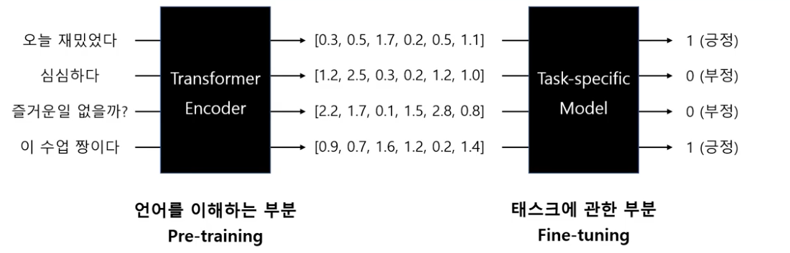

* toc
{:toc}

## Seq2Seq

autoencoder model(transformer encoder)로 문장에 대해서 이해를 시킨 다음에, \
autoregressive model(transformer decoder)로 문장을 뱉도록 만들면 좋은거 아니야?
{:.note title='Encoder-Decoder 구조의 시작'}

* 문장을 넣어서(seq) 문장 만들기(seq) → translation, summarization, sentence completion.
* encoder only : BERT, ELECTRA
* decoder only : GPT
* transformer all : T5, BART

배열을 언어로 바꾸는 Decoder

## Transformer 2017

> '문장의 맥락에 대해서 이해하는 컴퓨터를 만들고 싶다' \
> [1706 paper - Attention is all you need](https://arxiv.org/pdf/1706.03762.pdf) \
> 'the Transformer, based solely on attention mechanisms, dispensing with recurrence and convolutions entirely.'

1. 문장 내 단어들의 관계 특성, 문장 내 중요단어를 고려한 배열 생성 (self-attention)
2. 배열 생성을 조금씩 다른 방식으로(multi-head) 수십 번을 수행한 후 이를 concat → final 문장 배열

**word2vec과의 차이**

||Word2Vec|Transformer|
|---|---|---|
|배열의미|word|sentence|
|단어맥락파악|O|O|
|문장맥락파악|X|O|
|속도|빠름|느림|

### Transfer learning 전이학습

pre-trained된 언어모델을 가져다가 당면한 task에 적합한 모델을 덧붙이기 == fine-tuning
{:.figcaption}

언어 자체에 대해서 이해하는 일반적인 general한 영역이며, 대량의 텍스트로 학습을 해야해서 비싼 과정이다.

**BERT 논문에서의 4 가지 fine-tunning**

1. Sequence pair classification
2. Single sentence classification
3. QnA
4. Single sentence tagging
